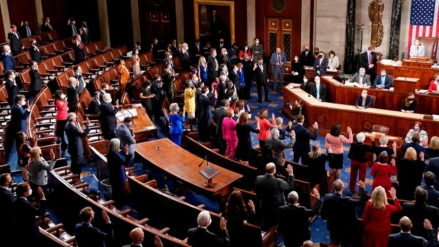

## Portfolio

### Congress Projects
#### [Cluster Analysis Public Policy](https://www.linkedin.com/pulse/cluster-function-congress-craig-asberry)

In this project, I clustered members of Congress by their characteristics using multidimensional scaling and cluster analysis. Then, I analyzed how their membership in a group affected how often they focused on substantive policies when communicating.

#### [Text Analysis of Congress](https://www.linkedin.com/pulse/top-5-policies-your-representatives-talk-craig-asberry/)

In this project, I scraped speeches from the Government Publishing Office and parsed it using Python. Then, I analyzed the speeches using the StructuralTopicModel package in R. This post is a small amount of the analysis included in a part of one chapter in my dissertation.
